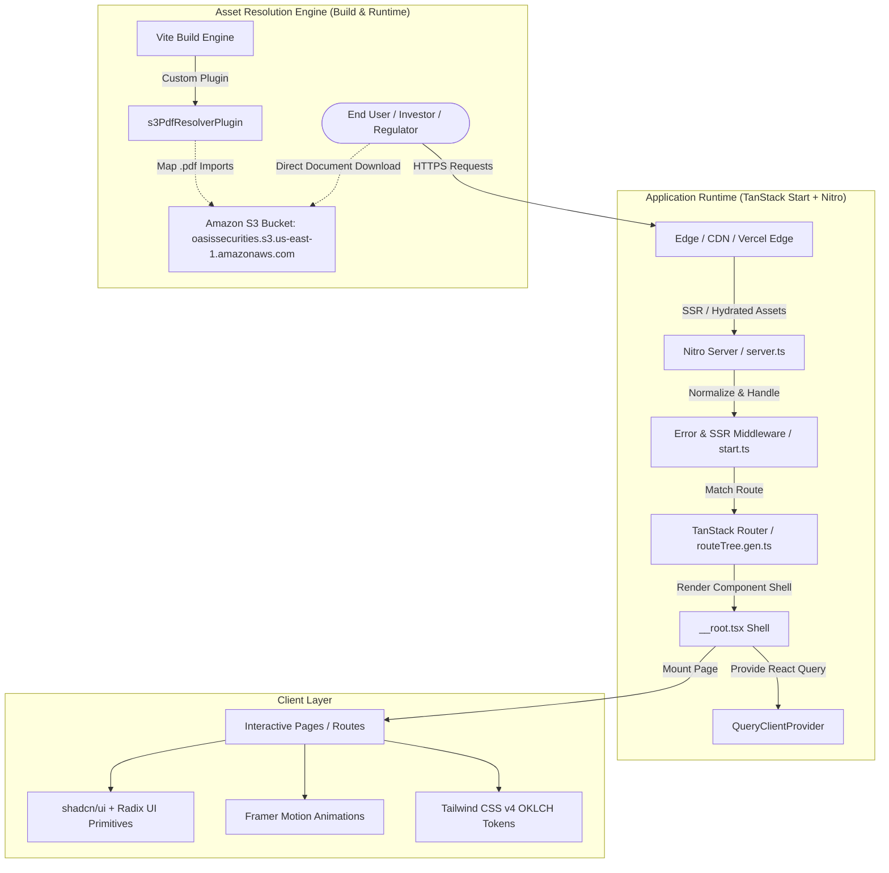
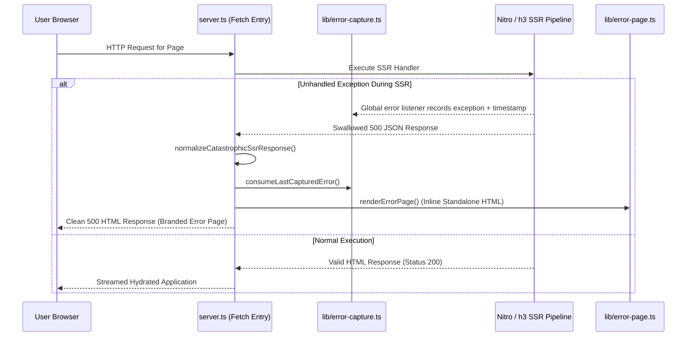
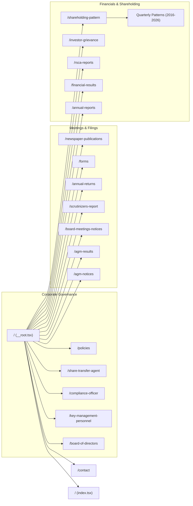
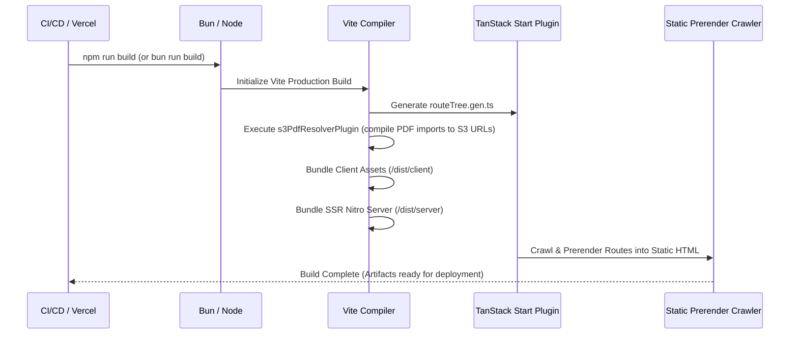

# System Design Document: Oasis Securities Limited Web Platform

**Document Version:** 1.0.0  
**Project:** Oasis Securities Limited (`anujtiwari04/Oasis`)  
**Target Platform:** TanStack Start (Full-stack React / Vite / Nitro SSR & Prerender)  
**Document Author:** Antigravity  
**Status:** Active Production Design  

---

## Table of Contents

1. [Executive Overview & Project Identity](#1-executive-overview--project-identity)
2. [High-Level Architecture & Tech Stack](#2-high-level-architecture--tech-stack)
3. [Key Architectural Innovations](#3-key-architectural-innovations)
   - [Virtual S3 PDF Asset Resolution Engine](#virtual-s3-pdf-asset-resolution-engine)
   - [Catastrophic SSR Error Recovery Pipeline](#catastrophic-ssr-error-recovery-pipeline)
   - [Hybrid Prerender & Static Generation Model](#hybrid-prerender--static-generation-model)
4. [Design System & UI/UX Specification](#4-design-system--uiux-specification)
   - [Brand Strategy & Visual Language](#brand-strategy--visual-language)
   - [Color Palette & OKLCH Semantic Tokens](#color-palette--oklch-semantic-tokens)
   - [Typography Hierarchy](#typography-hierarchy)
   - [Component System & Micro-Interactions](#component-system--micro-interactions)
5. [Information Architecture & Route Directory](#5-information-architecture--route-directory)
   - [Core Landing & Institutional Profile](#core-landing--institutional-profile)
   - [Corporate Governance & Board Administration](#corporate-governance--board-administration)
   - [Statutory Filings & Archival Disclosures](#statutory-filings--archival-disclosures)
   - [SEBI Regulation 31(1)(b) Tabular Shareholding Patterns](#sebi-regulation-311b-tabular-shareholding-patterns)
6. [Statutory Data Models & Regulatory Formats](#6-statutory-data-models--regulatory-formats)
7. [Directory Structure & Module Organization](#7-directory-structure--module-organization)
8. [Security, Performance & SEO Strategies](#8-security-performance--seo-strategies)
9. [Build, Deployment & Development Lifecycle](#9-build-deployment--development-lifecycle)

---

## 1. Executive Overview & Project Identity

### 1.1 Corporate Identity
**Oasis Securities Limited** is a public limited, non-deposit-taking Non-Banking Financial Company (NBFC) headquartered in Mumbai, Maharashtra, India. Established in 1986, the company delivers institutional financing solutions, credit facilities, Loans Against Property (LAP), and working capital assistance while maintaining disciplined credit quality, risk management, and statutory transparency.

| Corporate Parameter | Official Attribute |
| :--- | :--- |
| **Legal Entity Name** | Oasis Securities Limited |
| **Corporate Identification Number (CIN)** | `L51900MH1986PLC041499` |
| **Incorporation Date** | November 06, 1986 |
| **Stock Exchange Listing** | Bombay Stock Exchange (BSE) |
| **BSE Scrip Code** | `512489` |
| **ISIN** | `INE876A01023` |
| **RBI Registration Certificate** | NBFC Reg. No. `13.0069` (Dated 24.02.1998) |
| **NBFC Classification** | Base-Layer NBFC (RBI Scale-Based Regulatory Framework) |
| **Registered Office** | A-112, 1st Floor, Lodha Supremus, MIDC, Andheri East, Mumbai – 400093, MH |
| **Branch Office** | 2nd Floor, C 373, Behind Amar Jain Hospital, Block C, Vaishali Nagar, Jaipur – 302021, RJ |
| **Registrar & Transfer Agent (RTA)** | Satellite Corporate Services Pvt. Ltd. (Sakinaka, Mumbai) |

### 1.2 Purpose of the Web Platform
The web platform fulfills dual mandates:
1. **Institutional Investor Relations & Statutory Compliance**: Providing a verifiable, transparent single source of truth for mandatory disclosures under the Securities and Exchange Board of India (Listing Obligations and Disclosure Requirements) Regulations, 2015 (SEBI LODR) and RBI NBFC guidelines.
2. **Corporate & Commercial Credibility**: Establishing an authoritative digital footprint conveying stability, longevity, financial governance, and accessible touchpoints for clients, shareholders, and regulatory authorities.

---

## 2. High-Level Architecture & Tech Stack

The platform is designed as a modern, type-safe full-stack web application running on **TanStack Start**, leveraging **Vite**, **Nitro**, **Tailwind CSS v4**, and **React 19**.



### 2.1 Technology Stack Matrix

| Layer | Technology | Version | Rationale & Responsibility |
| :--- | :--- | :--- | :--- |
| **Full-Stack Meta-Framework** | TanStack Start | `^1.167.50` | Full-stack React framework featuring SSR, zero-waterfall routing, server functions, and automatic static prerendering. |
| **Routing Engine** | TanStack Router | `^1.168.25` | Fully type-safe file-based router with compile-time route generation (`routeTree.gen.ts`) and built-in scroll restoration. |
| **Data Fetching & Cache** | TanStack React Query | `^5.83.0` | Asynchronous state management and client-side caching foundation. |
| **UI Framework** | React | `^19.2.0` | Latest concurrent React engine with optimized JSX runtime and hydration. |
| **Build & Bundling Engine** | Vite | `^7.3.1` | Ultra-fast HMR, ESM bundling, and custom plugin pipelines. |
| **Server Engine** | Nitro / h3 | `3.0.260429-beta` | High-performance universal server abstraction powering TanStack Start. |
| **Styling & Theming** | Tailwind CSS | `^4.2.1` | Next-generation CSS framework using CSS-first `@theme` configuration, OKLCH color spaces, and zero-runtime overhead. |
| **UI Component Primitives** | Radix UI | Latest | Unstyled, accessible (WAI-ARIA compliant) headless primitives. |
| **Component Design System** | shadcn/ui | New York | Tailored React component library adhering to cohesive typography, elevation, and accessibility standards. |
| **Motion & Transitions** | Framer Motion | `^12.40.0` | Smooth physics-based micro-interactions, layout transitions, and entrance animations. |
| **Validation & Schema** | Zod | `^3.24.2` | Runtime type validation for input parameters and server functions. |
| **Icons** | Lucide React | `^0.575.0` | Scalable, accessible iconography. |
| **Asset Storage** | Amazon Web Services (AWS) S3 | US-East-1 | Cloud storage bucket hosting historical PDF archives and statutory documents. |
| **Runtime & Tooling** | Bun & Node.js | Bun / Node 22+ | Modern JavaScript runtime supporting fast installations and deterministic builds. |

---

## 3. Key Architectural Innovations

### Virtual S3 PDF Asset Resolution Engine

#### The Problem
Oasis Securities Limited is legally required to host over 15 years of statutory filings—including Quarterly Financial Statements, Annual Reports (FY 2009–2026), AGM proceedings, RSCA audits, Secretarial audits, and Board notices. Checking several gigabytes of binary PDF assets directly into the Git repository bloats clone times, impairs CI/CD pipelines, and breaches cloud hosting payload caps.

#### The Architectural Solution
The project implements a bespoke **Vite resolution plugin** (`s3PdfResolverPlugin`) in `vite.config.ts`. This plugin intercepts all `.pdf` import statements at compile time and dynamically rewrites them into Amazon S3 public URLs:

```typescript
const s3PdfResolverPlugin = () => {
  const S3_BUCKET_URL = "https://oasissecurities.s3.us-east-1.amazonaws.com";

  return {
    name: "s3-pdf-resolver",
    enforce: "pre" as const,
    resolveId(source: string) {
      if (source.endsWith(".pdf")) {
        return source;
      }
      return null;
    },
    load(id: string) {
      if (id.endsWith(".pdf")) {
        let relativePath = id;
        if (relativePath.startsWith("@/")) relativePath = relativePath.slice(2);
        if (relativePath.startsWith("/assets/")) relativePath = relativePath.slice(1);
        const srcAssetsIdx = relativePath.indexOf("src/assets/");
        if (srcAssetsIdx !== -1) {
          relativePath = relativePath.slice(srcAssetsIdx + 4);
        }
        relativePath = relativePath.replace(/\/+/g, "/");

        const s3Url = `${S3_BUCKET_URL}/${relativePath}`;
        return `export default ${JSON.stringify(encodeURI(s3Url))};`;
      }
      return null;
    },
  };
};
```

#### Operational Advantages:
1. **Developer Experience**: Developers write clean, idiomatic ESM imports:
   ```typescript
   import ar2026 from "@/assets/annual report/annual-report-2025-26.pdf";
   ```
2. **Zero Bundle Bloat**: The build process produces tiny string references instead of embedding base64 buffers or hashing files into `/dist/assets`.
3. **Decoupled Asset Management**: Legal and secretarial teams can upload new compliance PDFs directly to Amazon S3 without triggering application rebuilds, as long as filenames follow established conventions.
4. **CDN Caching**: Document downloads are served directly from AWS infrastructure, eliminating load on the application server.

---

### Catastrophic SSR Error Recovery Pipeline

During server-side rendering in Nitro/h3 environments, unhandled exceptions inside handlers can occasionally be coerced into generic `500 Internal Server Error` responses with JSON payloads (`{"unhandled":true,"message":"HTTPError"}`), bypassing standard `try/catch` handlers.

The project implements a two-stage error capture and recovery architecture:



1. **`src/lib/error-capture.ts`**: Subscribes to `globalThis` `error` and `unhandledrejection` events with a time-to-live (TTL) window of 5,000ms.
2. **`src/server.ts`**: Inspects server responses; if an unhandled JSON error is detected, it consumes the captured stack trace and returns a standalone, zero-dependency HTML fallback page generated by `src/lib/error-page.ts`.
3. **`src/start.ts`**: Middleware captures upstream server errors and protects against cascading crashes.

---

### Hybrid Prerender & Static Generation Model

To maximize search visibility (crucial for BSE ticker discovery, compliance verification, and investor inquiries) while retaining SSR capabilities for dynamic features, `vite.config.ts` activates TanStack Start prerendering:

```typescript
tanstackStart({
  importProtection: {
    behavior: "error",
    client: {
      files: ["**/server/**"],
      specifiers: ["server-only"],
    },
  },
  prerender: {
    enabled: true,
    crawlLinks: true,
  },
})
```

- **Link Crawling**: The prerender engine starts at root (`/`) and crawls all discoverable hyperlinks across menus, tables, and footers, generating static HTML snapshots for all 40+ statutory pages.
- **Instant First Contentful Paint (FCP)**: Visitors receive immediate, fully rendered HTML without layout shifts or loader spinners.

---

## 4. Design System & UI/UX Specification

### 4.1 Brand Strategy & Visual Language
The visual identity is tailored to reflect a registered Non-Banking Financial Company with nearly four decades of history. It rejects generic fintech gradients in favor of an **institutional, dignified aesthetic**:
- Deep Forest Green represents stability, wealth preservation, and institutional trust.
- Heritage Gold denotes regulatory accreditation, quality, and legacy.
- Clean Warm Charcoal & Linen Off-White surfaces provide an uncluttered, high-readability reading environment for complex financial data.

### 4.2 Color Palette & OKLCH Semantic Tokens

Configured in `src/styles.css` using Tailwind CSS v4's `@theme inline` mapping:

```
┌────────────────────────────────────────────────────────────────────────┐
│                          BRAND COLOR MATRIX                            │
├────────────────────────────┬───────────┬───────────────────────────────┤
│ Token Name                 │ Hex/Value │ Usage Context                 │
├────────────────────────────┼───────────┼───────────────────────────────┤
│ --brand-green              │ #1B4332   │ Primary brand color, headers, │
│                            │           │ primary CTA buttons, footer   │
│ --brand-green-light        │ #2D6A4F   │ Hover states, active borders  │
│ --brand-green-lighter      │ #40916C   │ Accents, badges, highlights   │
│ --brand-gold               │ #B68D40   │ RBI badge borders, dividers,  │
│                            │           │ sub-headings, accents         │
│ --brand-gold-light         │ #D4A853   │ Subtle glow, hover accents    │
│ --brand-charcoal           │ #1C1C1C   │ Headings, high-contrast text  │
│ --brand-text               │ #2C2C2C   │ Body text, paragraph content  │
│ --brand-surface            │ #FAFAF8   │ Primary page background       │
│ --brand-surface-alt        │ #F5F3EF   │ Table headers, card callouts  │
└────────────────────────────┴───────────┴───────────────────────────────┘
```

#### Modern OKLCH System Support
The system also defines semantic CSS custom properties in `oklch(...)` for shadcn/ui components (`--background`, `--foreground`, `--card`, `--primary`, `--muted`, `--border`), ensuring smooth transitions and full dark-mode compatibility.

### 4.3 Typography Hierarchy

| Font Family | Applied Elements | Scale / Sizes | Characteristics |
| :--- | :--- | :--- | :--- |
| **DM Serif Display** (`--font-serif`) | Hero title accents, editorial taglines | `3rem` – `4.5rem` (`text-5xl` – `text-7xl`) | Elegant, traditional serif typography evoking financial stability. |
| **Inter** | All functional UI, headings, tables, body copy | `0.75rem` – `2.25rem` (`text-xs` – `text-4xl`) | Neutral, modern sans-serif with high x-height for maximum legibility in numerical data. |

```
H1 Display:     Inter Bold / DM Serif Italic (36px - 72px)
H2 Section:     Inter Bold (24px - 36px)
H3 Card/Table:  Inter SemiBold (18px - 24px)
Body Text:      Inter Normal (14px - 16px, line-height 1.6)
Caption/Meta:   Inter Medium (11px - 13px, tracking-widest, uppercase)
```

### 4.4 Component System & Micro-Interactions

1. **Navigation Header (`Header.tsx`)**:
   - Top utility bar with telephone link and permanent CIN display (`L51900MH1986PLC041499`).
   - Sticky header with backdrop-blur (`bg-white/90 backdrop-blur-md`).
   - Multi-tier cascading dropdown menu for **Corporate** filings with nested fly-outs (e.g., *Postal Ballot* sub-items).
   - Animated mobile navigation drawer powered by Framer Motion (`AnimatePresence`, sliding off-canvas drawer).
2. **Hero Section (`Hero.tsx`)**:
   - Dynamic SVG grid overlay with subtle opacity (`rgba(27, 67, 50, 0.08)`).
   - Real-time animated institutional bar graph simulating financial stability and sustainable growth.
   - Quick stats badges (`1986 Incorporated`, `NBFC Registered`, `4+ Services`, `PAN India Reach`).
3. **Institutional Data Tables**:
   - Fully accessible tables styled with high-contrast slate headers (`bg-slate-900 text-white`).
   - Row-hover feedback, responsive horizontal overflow wrappers, and direct download buttons featuring Lucide `Download` and `FileText` icons.
4. **Instant Search Filtering**:
   - Integrated on high-volume routes such as `/shareholding-pattern` and `/newspaper-publications`.
   - Real-time client-side substring matching on titles and financial periods.

---

## 5. Information Architecture & Route Directory

The application employs a comprehensive directory structure under `src/routes/`. Every route represents an investor relations touchpoint or statutory disclosure obligation.



### Route Inventory & Functional Matrix

| Route Path | Associated Component / Purpose | Data Type / Content |
| :--- | :--- | :--- |
| `/` | Landing page (`index.tsx`) | Company introduction, NBFC status, core business lines, leadership overview, contact details. |
| `/contact` | Contact directory (`contact.tsx`) | Registered office (Mumbai), Branch office (Jaipur), direct phone lines, administrative emails, grievance desk. |
| `/board-of-directors` | Board governance (`board-of-directors.tsx`) | Comprehensive roster of directors with official DIN/UID identifiers and executive designations. |
| `/key-management-personnel`| KMP directory (`key-management-personnel.tsx`) | Profiles and direct contact points for MD, WTD, CFO, and Company Secretary. |
| `/compliance-officer` | Compliance officer portal (`compliance-officer.tsx`) | Profile of Mrs. Kirti Mool Chand Jain with one-click call and email triggers. |
| `/share-transfer-agent` | RTA details (`share-transfer-agent.tsx`) | Satellite Corporate Services Pvt. Ltd. contact addresses, landline numbers, and support email. |
| `/policies` | Statutory policies (`policies.tsx`) | 17 mandatory policies including Whistle Blower, Related Party Transactions, Materiality, and AML Literature. |
| `/annual-reports` | Annual reports archive (`annual-reports.tsx`) | Complete yearly PDF archive spanning FY 2009–10 through FY 2025–26. |
| `/annual-returns` | Annual returns (`annual-returns.tsx`) | Official Form MGT-7 filings from FY 2016–17 through FY 2024–25. |
| `/financial-results` | Financial statement hub (`financial-results.tsx`) | Over 50 quarterly audited and unaudited reports from 2013 to 2026. |
| `/agm-notices` | Shareholder meeting notices (`agm-notices.tsx`) | Notice documentation for AGMs and EOGMs spanning 2013 to 2026. |
| `/agm-results` | AGM voting results (`agm-results.tsx`) | Official meeting proceedings, outcome notifications, and combined voting reports. |
| `/board-meetings-notices` | Board meetings announcements (`board-meetings-notices.tsx`)| Prior intimations and notices for quarterly board meetings. |
| `/newspaper-publications` | Media disclosures (`newspaper-publications.tsx`) | Searchable repository of public notices published in Financial Express (FE) and Mumbai Lakshadeep (ML). |
| `/rsca-reports` | Share capital audit (`rsca-reports.tsx`) | Quarterly Reconciliation of Share Capital Audit reports (2024–2026). |
| `/investor-grievance` | Grievance redressal (`investor-grievance.tsx`) | SEBI Regulation 13(3) quarterly complaint statements. |
| `/scrutinizers-report` | Postal ballot / Voting (`scrutinizers-report.tsx`) | Independent scrutinizer reports on shareholder votes (2013–2025). |
| `/forms` | Investor services (`forms.tsx`) | Standard investor forms: ISR-1, ISR-2, ISR-3, SH-13, SH-14, MOA, and AOA. |
| `/shareholding-pattern` | Shareholding hub (`shareholding-pattern.tsx`) | Searchable master index routing to individual quarterly shareholding reports. |

### Dedicated Tabular Shareholding Routes (SEBI Format)
The platform houses over 20 dedicated routes delivering full-fidelity statutory shareholding disclosure tables matching SEBI's electronic filing formats:
- `/shareholding-pattern-mar-2026`
- `/shareholding-pattern-dec-2025`
- `/shareholding-pattern-sep-2025`
- `/shareholding-pattern-june-2025`
- `/shareholding-pattern-mar-2025`
- `/shareholding-pattern-dec-2024`
- `/shareholding-pattern-june-2024`
- `/shareholding-pattern-sep-2023`
- `/shareholding-pattern-june-2023`
- `/shareholding-pattern-mar-2023`
- `/shareholding-pattern-dec-2022`
- `/shareholding-pattern-sep-2022`
- `/shareholding-pattern-mar-2022`
- `/shareholding-pattern-dec-2021`
- `/shareholding-pattern-sep-2021`
- `/shareholding-pattern-june-2021`
- `/shareholding-pattern-mar-2021`
- `/shareholding-pattern-dec-2020`
- `/shareholding-pattern-sep-2020`
- `/shareholding-pattern-march-2017`
- `/shareholding-pattern-dec-2016`
- `/shareholding-pattern-sept-2016`

---

## 6. Statutory Data Models & Regulatory Formats

The dedicated shareholding pattern routes strictly replicate the multi-section reporting format prescribed under **Regulation 31(1)(b) of SEBI (Listing Obligations and Disclosure Requirements) Regulations, 2015**:

```
┌──────────────────────────────────────────────────────────────────────────┐
│              SEBI REGULATION 31(1)(b) COMPLIANCE STRUCTURE               │
├───────────┬──────────────────────────────────────────────────────────────┤
│ SECTION 1 │ General Information About Company                            │
│           │ Scrip code, ISIN, Class of Security, Quarter Ended,          │
│           │ Regulation type, PSU status.                                 │
├───────────┼──────────────────────────────────────────────────────────────┤
│ SECTION 2 │ Declaration Table (11 Regulatory Checks)                     │
│           │ Partly paid shares, Convertible securities, Warrants, ESOPs, │
│           │ Locked-in shares, Pledged shares, Differential voting, SBO.  │
├───────────┼──────────────────────────────────────────────────────────────┤
│ SECTION 3 │ Table VI - Statement Showing Foreign Ownership Limits        │
│           │ Approved limits (%) vs. Limits utilized (%) over 4 quarters. │
├───────────┼──────────────────────────────────────────────────────────────┤
│ SECTION 4 │ Table I - Summary Statement (Part A: Holding & Voting)       │
│           │ Category (Promoter vs. Public), Number of shareholders,      │
│           │ Paid up shares, Total voting rights held (Class X/Y).        │
├───────────┼──────────────────────────────────────────────────────────────┤
│ SECTION 5 │ Table I - Summary Statement (Part B: Demat & Encumbrance)    │
│           │ Shares held in dematerialized form, Locked-in percentages,   │
│           │ Encumbrances, Sub-categorization of public holdings.         │
├───────────┼──────────────────────────────────────────────────────────────┤
│ SECTION 6 │ Table II & III - Detailed Shareholding Breakdown             │
│           │ Promoter & Promoter Group breakdown (Individuals/HUF,        │
│           │ Bodies Corporate) and Public Institutional/Non-Institutional.│
└───────────┴──────────────────────────────────────────────────────────────┘
```

### Capital Structure Snapshot (from December 2025 Filing)
- **Total Fully Paid Equity Shares**: 18,500,000 shares
- **Promoter & Promoter Group**: 13,096,090 shares (**70.79%**) across 4 holders (100% dematerialized)
- **Public Shareholding**: 5,403,910 shares (**29.21%**) across 1,871 shareholders (4,778,300 dematerialized)
- **Non-Promoter Non-Public**: 0 shares (0.00%)
- **Foreign Ownership Utilized**: 0.37% (against 100% approved limit)

---

## 7. Directory Structure & Module Organization

```
d:/Projects/Oasis/
├── bun.lock                      # Bun lockfile for reproducible dependency trees
├── bunfig.toml                   # Bun configuration file
├── components.json               # shadcn/ui configuration (New York style, slate base)
├── eslint.config.js              # ESLint flat configuration
├── package.json                  # Dependencies, scripts, and package metadata
├── tsconfig.json                 # TypeScript compiler options and path aliases (@/*)
├── vercel.json                   # Vercel deployment orchestration and build triggers
├── vite.config.ts                # Vite config with S3 PDF resolver & TanStack Start
│
└── src/
    ├── assets/                   # High-resolution logos & branding media
    │   ├── Oasis Logo with bg.png
    │   └── Oasis Logo.png
    │
    ├── components/
    │   ├── site/                 # Custom brand-specific structural components
    │   │   ├── About.tsx         # Corporate overview, incorporation history, NBFC facts
    │   │   ├── Contact.tsx       # Contact information cards and communication channels
    │   │   ├── Corporate.tsx     # Tabbed governance preview module
    │   │   ├── Footer.tsx        # Branded footer with legal copyright and FAQ link
    │   │   ├── Header.tsx        # Multi-level responsive navigation bar & mobile drawer
    │   │   ├── Hero.tsx          # Institutional hero section with animated metric bars
    │   │   └── Links.tsx         # Regulatory external links (SEBI, BSE, SMART ODR)
    │   │
    │   └── ui/                   # shadcn/ui + Radix UI primitive components
    │       ├── accordion.tsx     # Collapsible panels
    │       ├── button.tsx        # Semantic button variants
    │       ├── dialog.tsx        # Accessible modal dialogs
    │       ├── table.tsx         # Accessible tabular display elements
    │       └── ... (35+ additional accessible primitives)
    │
    ├── hooks/
    │   └── use-mobile.tsx        # Responsive viewport detection hook
    │
    ├── lib/
    │   ├── api/
    │   │   └── example.functions.ts  # TanStack Start createServerFn sample endpoints
    │   ├── config.server.ts      # Server-only environment variables (isolated from client)
    │   ├── error-capture.ts      # Out-of-band SSR exception recorder
    │   ├── error-page.ts         # Zero-dependency standalone fallback error page
    │   └── utils.ts              # Class name merging utility (clsx + tailwind-merge)
    │
    ├── routes/                   # File-based TanStack Start route tree
    │   ├── __root.tsx            # Global HTML document shell, meta tags, and font links
    │   ├── index.tsx             # Commercial landing page
    │   ├── contact.tsx           # Contact directory
    │   ├── board-of-directors.tsx
    │   ├── key-management-personnel.tsx
    │   ├── compliance-officer.tsx
    │   ├── share-transfer-agent.tsx
    │   ├── policies.tsx
    │   ├── annual-reports.tsx
    │   ├── annual-returns.tsx
    │   ├── financial-results.tsx
    │   ├── agm-notices.tsx
    │   ├── agm-results.tsx
    │   ├── board-meetings-notices.tsx
    │   ├── newspaper-publications.tsx
    │   ├── rsca-reports.tsx
    │   ├── investor-grievance.tsx
    │   ├── scrutinizers-report.tsx
    │   ├── forms.tsx
    │   ├── shareholding-pattern.tsx
    │   └── shareholding-pattern-*.tsx  # 20+ specific quarterly SEBI disclosure pages
    │
    ├── routeTree.gen.ts          # Auto-generated TanStack router configuration
    ├── router.tsx                # Router factory and QueryClient instance initialization
    ├── server.ts                 # Nitro server entry with catastrophic error normalization
    ├── start.ts                  # TanStack Start instance with server error middleware
    └── styles.css                # Tailwind CSS v4 design system, @theme, and OKLCH definitions
```

---

## 8. Security, Performance & SEO Strategies

### 8.1 Security Architecture
- **Server Isolation**: Server secrets and sensitive configuration are confined to `.server.ts` modules (`src/lib/config.server.ts`). TanStack Start's `importProtection` actively blocks any server-only modules from leaking into client bundles during build:
  ```typescript
  importProtection: {
    behavior: "error",
    client: {
      files: ["**/server/**"],
      specifiers: ["server-only"],
    },
  }
  ```
- **XSS & Content Sanitization**: All tabular disclosures render pure React nodes without `dangerouslySetInnerHTML`.
- **External Asset Safety**: All external hyperlinks (BSE, SEBI, SMART ODR) enforce `rel="noopener noreferrer"` and `target="_blank"`.

### 8.2 Performance Architecture
- **Offloaded Heavy Binary Transfer**: Zero PDF binaries are hosted or streamed from the Node.js/Nitro web server. Downloads route directly to Amazon S3's optimized object storage.
- **Deduplicated Bundles**: Critical shared libraries (`react`, `react-dom`, `@tanstack/react-query`) are explicitly deduplicated in `vite.config.ts`.
- **Lightweight CSS Engine**: Tailwind CSS v4 compiles directly without heavy PostCSS runtimes, generating minimal, purged utility classes.
- **Scroll Restoration**: TanStack Router maintains user scroll position across route navigations (`scrollRestoration: true`).

### 8.3 Search Engine Optimization (SEO) & Metadata
Configured in `src/routes/__root.tsx`:
- Full OpenGraph metadata (`og:title`, `og:description`, `og:type`).
- Standardized document title: `Oasis Securities Limited`.
- Meta description highlighting NBFC registration, BSE listing, and institutional offerings.
- Google Font preconnecting (`fonts.googleapis.com` and `fonts.gstatic.com` with `crossOrigin`) to optimize font swap times.

---

## 9. Build, Deployment & Development Lifecycle

### 9.1 Package Scripts

```json
"scripts": {
  "dev": "vite dev",
  "build": "vite build",
  "build:dev": "vite build --mode development",
  "preview": "vite preview",
  "lint": "eslint .",
  "format": "prettier --write ."
}
```

### 9.2 Build Pipeline Execution Flow



### 9.3 Deployment Platform
The application is preconfigured for deployment on **Vercel** (`vercel.json`), utilizing serverless/edge functions for SSR combined with edge caching for prerendered compliance pages.

---

## 10. Conclusion & Maintenance Guidelines

The Oasis Securities Limited web platform represents a modern, resilient, and legally rigorous architecture for an Indian listed NBFC.

### Maintenance Best Practices:
1. **Adding New Quarterly Disclosures**:
   - Upload the filing PDF to the S3 bucket under the appropriate folder (e.g., `assets/Shareholding pattern/`).
   - Add the corresponding record to the route array or create a dedicated `shareholding-pattern-*.tsx` file if full tabular disclosure is required.
2. **Updating Corporate Policies**:
   - Upload revised PDF to S3.
   - Update the reference in `src/routes/policies.tsx`.
3. **Route Generation**:
   - Never manually modify `src/routeTree.gen.ts`. It is continuously updated by the Vite development server and build tasks.

